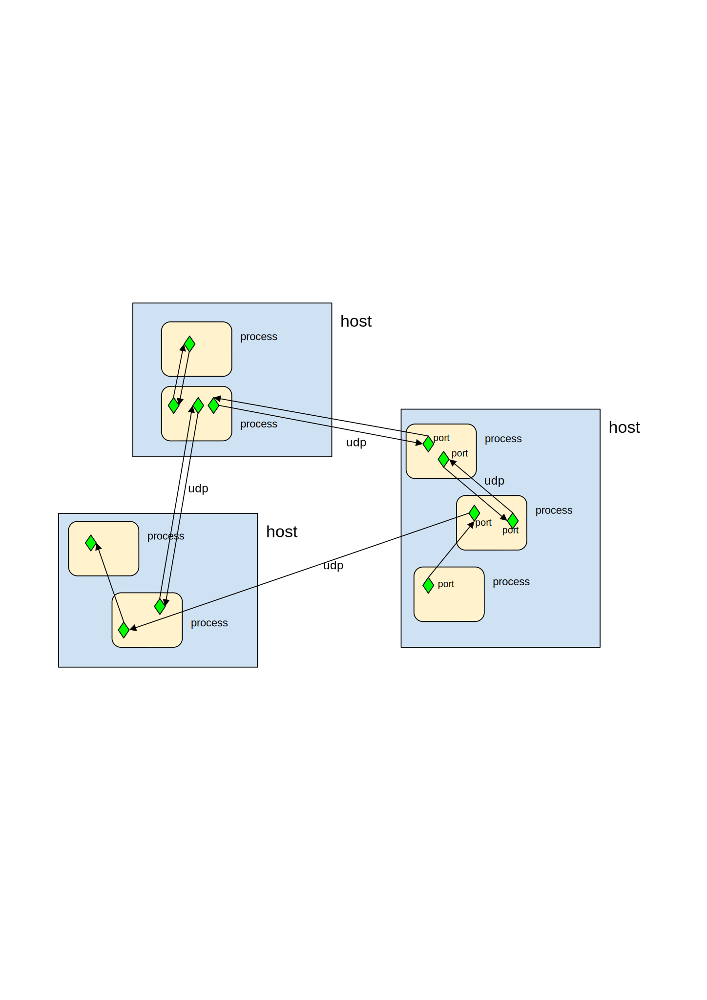

###Author: Enrico Segre

###Purpose:
to establish the infrastructure for interprocess communication among instances of Matlab running on the same or different computers. Reinventing the wheel but doing it with LAST requirements in mind. Provisional layout.

###Note:
the current implementation (20/10/2020) has slightly different properties and methods than what described below - I defer the update to after it has passed some code review and on the road testing.

#General considerations:
##Using tcp/ip or udp?
Besides the usual consideration (tcpip has a built-in mechanism for ensuring message reception, udp not and hence may require the addressee to reply with an acknowledgement), there are other factors, some general of the two protocols, and some specific of the matlab implementation, which come into play:

* we prefer an implementation in which a sender can be created before an actual listener exists
* conversely, we prefer implementations in which a listener can be started before a corresponding sender exists
* we’d like N-to-1 and 1-to-N to be possible (considering both cases in which N are on the same host but separate processes or on different hosts)
* we prefer asynchronous, i.e. non blocking operation, even asynchronous opening (not blocking till a connection is established, i.e. till the other party exists)
Tcpip is inherently 1:1 and hence a complicated dispatching daemon would be needed for 1:N and N:1.
Whatever choice, it seems to me unavoidable that each participating process must have a priori knowledge of whom it may want to talk to, and whom may be talking to it. Unless, it is possible to set up a generic listener to any incoming messages.
IIUC the only form of broadcast implementable in matlab is udp(‘EnablePortSharing’,’on’). This only allows other udp receivers on processes on the same machine to use the same local port. Not a multicast write to all remote listeners.
Tcpip in matlab have the following drawbacks:
* a tcpip object has to be declared a priori “client” or “server”
* a “client” tcpip object errors at fopen() if there is no server answering at the destination address
* fopen() is blocking for a “server” tcpip object. An implementation of messengers using it would mean probably no matlab prompt, session dedicated as server, execution of commands possible only upon tcpip callbacks
* udp objects support a datagram terminator and a DatagramReceivedFcn callback, tcpip not
Implementation considerations:
* a channel requires the creation of a messenger object on both participating parties
* an udp object can be set with host=0.0.0.0, accepting connections from any host (where did I read it?), or with a specific host, accepting connections only from it
* an udp object (a tcpip as well, but I excluded them above) can have a defined LocalPort  (if not it is probably arbitrary) (should also require LocalPortMode=’manual’). This can be eventually numerically the same as RemotePort, if it helps mnemonics, if the udp object is the only one on that host and if it points to a remote host. It would become utterly confusing and create unwanted echoes to define coinciding LocalPort and RemotePort otherwise.
* A map of which messenger is in which process and to whom else it is devised to talk is therefore mandatory
* udp objects with the quartet {localhost,LocalPort,DestinationHost,DestinationPort} implement an unidirectional communication channel between two processes. Most of the time we may want bidirectional channels, i.e. in the destination process we’ll create a dual Messenger with the two couples of attributes exchanged. That way the receiver knows whom to reply to.
* In summary, an implementation with udp objects implies that we have clear the oriented graph of messenger channels. Hosts contain processes, processes contain messengers endpoints as nodes, messengers are directed graph edges. And that we instantiate our processes, creating in each one the desired Messengers, according perhaps to a configuration file read at launch.



* several udp Messengers pointing to the same DestinationPort seems possible and viable. This realizes an unidirectional N-to-1 communication.
* buffer issues: an udp channel has a fixed input and output buffer size (default size is 512 for both). This may be small for accommodating chains of queued commands, or long answers to queries (though this messaging functionality is not designed to pass large quantities of data). The defaults can easily be increased if the need arises.
* commands passed with this messaging scheme are evaluated in some workspace. This is a problem because Matlab doesn’t allow many possibilities, and is not sophisticated with namespacing. Workspace can be that of the reading function, that of its caller, or the base (I’m choosing the latter, rather than to have to declare global variables within the listener function. One cannot make a generic listener and let it know about all the potentially relevant objects)
* Callbacks are queued, but are not executed while the main thread is busy. Keep this in mind to account for a large enough input buffer.
* No idea yet whether viable multithreading can be achieved with batches and parallel workers. My impression is definitely better not to mess around with it. In case, let the listener sit in the most of the time free, main workspace, and let heavy commands be dispatched to workers. i/o in detached workers looks like a bad idea.

#Adopted implementation:

##Messenger object:
###Purpose:
 open an UDP socket to send/receive messages from other actors. The object creates at the same time a connection for sending and for listening to messages coming from other actors. To keep things at the bare bone, the Messenger is agnostic w.r.o. being a client or a server. It is the software employing it which decides its function.

A matlab session can have several Messenger objects instantiated, to provide separate channels of communication with other actors.

####Properties, visible:

* **LocalPort:** port of the originator (host is always localhost)
* **DestinationHost:** the target host of the Messenger
* **DestinationPort:** the target port
* **Name:** free text, can be used to define the functionality which is assigned to the messenger, or the process which launched it. A client could for example send a command which asks “who are you?” (reply me with your Label) and ensure it is talking to the right listener.
* **MessagesSent:** increasing number of messages sent (possibly helping to debug races)

####Properties, hidden:

* **Verbose:** boolean or numeric, for blabber. 2 is higher than true
* **LastError:** string reporting the last error appeared, or empty if none
* **LastMessage:** copy of the last message received. in order to implement a query mechanism
* **StreamResource:** the native udp object of Matlab.In some circumstances some properties of
   it need to be accessed. E.g., **.StreamResource.OutputBufferSize**, **.StreamResource.Timeout**
* **CallbackRespond:** if true, the listener() method (see below) is fired automatically then the
  receiving buffer gets a terminator character. With that, the messenger immediately interprets
  and processes incoming commands. If false, this does not happen; to process the commands,
  listener() must be called explicitly. The reason for this is that Matlab does not allow nested
  callbacks. If a messenger query would be inserted in a callback function (e.g. that of a timer),
  the query would time out because the datagram event would be processed only after the first callback call.
  Implementing this property, it is possible to devise a query() method which does not require further callbacks.
  However, keep in mind that a Messenger with this property set to false will not automatically respond to
  incoming commands. 

####Methods, public:

* **open:** besides opening an IP:port channel, it creates a callback function for the listener.
* **send(Message):** serializes the message as JSON string, and transmits it as a stream through Message.Address.
* **reply(Message):** sends back a message to Message.ReplyTo, but with which Command and Content?
* **query(Message):** (blocking) send a message and wait for its returning answer
* **areYouThere:** a simplified query which returns true if the other end of the Messenger replies back
* **close:** closes the IP:port channel
* **delete:** remove also the listener callback

####Methods, private
* listener: a callback function which fires whenever the receive buffer is full and terminated by an EOT character. 

Buffering of sequenced commands is hopefully just a consequence of buffered callbacks in Matlab (should be a private method, current implementation constraints make it public)


####TBD:
* Does the listener just eval the Message.Command (thus all responsibility is left to its sender)? Or do we want any parsing/validation infrastructure in place?
* Should it be allowed to redefine the listener callback specifically, or any Messenger object should implement the same standard listener?
* Which use of Message.Content is made? The MessageCommand could perhaps make explicit use of Message.Content when required.
* Is it possible to define priority messages? Probably not if there is only one callback listener, though if all action commands are non blocking, an emergency stop command may be able to abort any action still running.
* How to implement a query operation? In principle, a message with RequestReply, sent to a Messenger which is set to reply to the originating address. The output of the command on the destination process can be copied in the reply .Content. But then the listener on the originating process should know that it can make use of it.
* The additional problem with queries is that returning messages could come back out of order. Possibly the only way out is to implement a message queue, filled by the listener, and consumed by some other task. A bonus of a message queue is that priorities can be implemented by rearranging the queue, and encoding urgent messages on top.
* when/how to make the listener interruptible by other callbacks, when not
* behavior with commands requiring a long execution time


####Note:
 the simplicity of .Command presumes that each messenger knows what the receiver is up to do, and issues a command appropriate to whom is listening. This is not a complete decoupling, and needs that the roles are known a priori.


##Message object
###Properties:
* **From:** Messenger.Address of the originator
* **ReplyTo:** where to send the reply if required. Equal to .From if omitted
* **Destination:** list of Messenger.Address-es the message is sent to, or Broadcast if the message is to be sent to every listener on the subnet.
* **SentTimestamp:** time at which the sender Messenger issued the message
* **ReceivedTimestamp:** time at which the receiving Messenger got the message
* **ProgressiveNumber:** a progressive number provided by the Messenger, incrementing at each new command sent.
* **Command:** to keep things simple, the bare matlab command to be immediately evaluated, in the base workspace (one workspace has to be chosen, and there are not many options with matlab). If the command is to be executed at later time, `Message.Command` should either contain an appropriate pause() (blocking, probably), or define itself a timer object, or call a specific method of the receiving matlab session, which does that. Ditto for commands implying a periodic execution: all the logic is responsibility of the receiver.
* **RequestReply:** boolean: false, just execute; true, report or acknowledge reception.
* **Content:** cell, or structure, or JSON-serialized data, if data is not included otherwise in Command. Can be empty. Data returned by a query is stored as Content.


**Message.SentTimestamp**, **Message.ReceivedTimestamp** and **Message.ProgressiveNumber** are there to help sort out, debug and log possible race conditions. For mechanisms forwarding messages, one could decide to keep always the initial SentTimestamp.

Deliberately, to keep things simple and very generic, I’m not making any provision here for commands to be executed at future time, promises, periodical execution.

Reception acknowledgements could be sent back as returning messages with empty command and `Content=true` (e.g.). However, that presupposes that the dual Messager is created on the destination host, and if not the situation should be trapped on the receiving Messenger.

I’m in doubt about properties like **ReplyTo** or **Destination**, because the capability of routing the message is predefined by the Messenger, not by the Message, in my first implementation. Unless we add to the listener callback the functionality of searching for another messenger within the process, which is capable of dispatching the message to its destination -- it’s another level of complexity, namely implementing routing, which I wouldn’t enter now.


The **AreYouThere** Message: merely implements a ping. Polling the Status of a device should be done with an appropriate command querying the device.Status property, or something like that, it is one level of complexity above it.

###Methods:

* **creator:** `obs.util.Message([ [Command] [,Content] ])` creates a Message, prefilling some fields. Some fields like Timestamp or Address are provided by the Messenger at the moment of `Messenger.send`.
* none other I can think of at this very moment. Could grow if there are manipulations of messages (e.g. an actor decides to envelope a received message and forward it to another actor)
Communication with other processes, not Matlab sessions

It would be possible, it is just sufficient that the other applications send/digest over udp json strings complying with the format of a flattened Message, like e.g.:
```
'{"From":"","SentTimestamp":[],"ReceivedTimestamp":[],"ProgressiveNumber":-1,"Command":"","RequestReply":false,"Content":[]}'
```